# Armory Digest April 2020


## Small community roundup

**April is here! It's nice and warm outside! - So better stay inside...**

The second issue of Armory Digest will be a little different from the first, as the first had a lot more changes to focus on, from the whole time period from version 0.5. Instead, this issue will be a little more article based, focusing on tips/tricks and tutorials. On the forums a brief roundup will be posted, while the full articles is posted on Github pages with more images, videos and interactive content. At least once I manage to get it running...

Anyway, this months issue might be a bit smaller, as the first march issue was posted roughly halfway through march - so you only get half a months worth of news.

----------------------------------------------------

## News

- Accelerated Raytracing on AMD cards!
-- With the release of Vulkan Ray Tracing, accelerated raytracing on AMD cards for Armorpaint is on the way!
-- Lubos has already implemented DXR (DirectX Raytracing) in Armorpaint (Very useful for baking maps), and stubs for raytracing code is already present in Armory (Link, Link). It should be noted that the raytracing technology is still perhaps a few years from seeing a general breakthrough in gaming, having support on both Nvidia and AMD cards is a step towards seeing use in Armory!

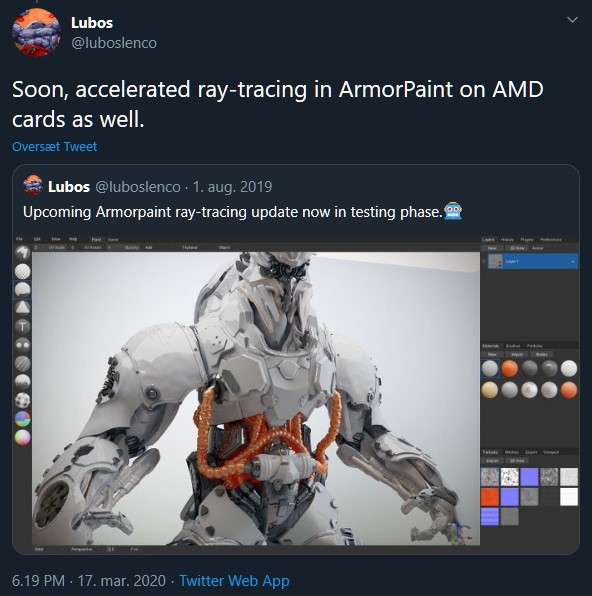

- BlackGoku36 launched a tutorial website!
-- BlackGoku36 launched a website on Github pages containing tutorials for both beginners to Armory as well as intermediate users, and currently covers topics such as getting started, nav meshes, traits, canvas as well as longer tutorial which goes in more depth with a city building simulator. Happy reading!


- Naxela have begun implementing lightmapping on a separate branch.
-- Naxela have begun implementing lightmapping into Armory as an alternative to baked complete maps. It will be available in the future as an option in the Armory bake panel. This includes support for 32-bit HDR maps, as well as 8-bit encoded RGBM or LogLUV for smaller memory impact, as well as support for Intel OIDN or Nvidia Optix denoising and OpenCV filtering. Still a long way to go.

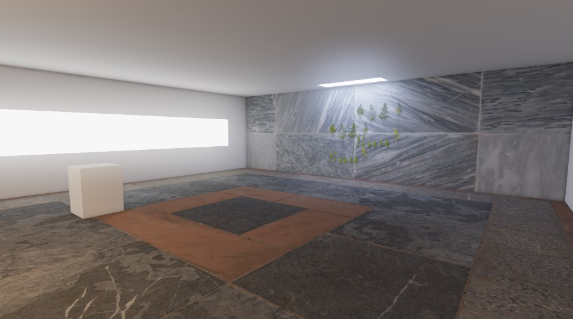

- Upcoming Armory3D Game competition?:
-- In these corona quarantine times where people are bored at home, it might be a good idea to launch the first Armory3D game competition (A3DGC?), especially now that people have time for it anyway. Mind you it doesn't have to be complicated games, and while Armory3D might have it's bugs, but making games should still be possible. Especially if kept as simple as possible, i.e. platformers, puzzles, side-scrollers.
I'll be interested in providing a reward as well, if anyone is interested?

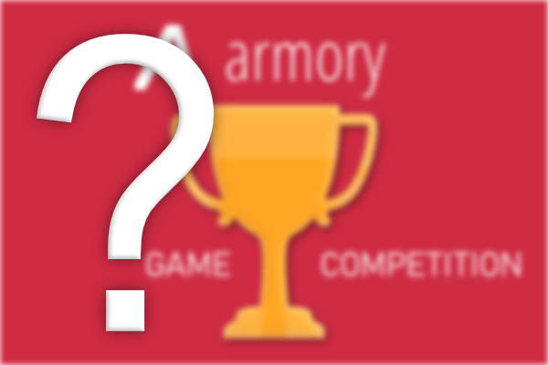

---

## Notable changes in Armory/Armory2D/Iron/ZUI

This months Armory SDK is out, get it on itch: https://armory.itch.io/armory3d

- Play action from frame node

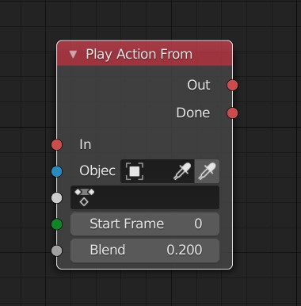

- Support for box and triplanar mapping

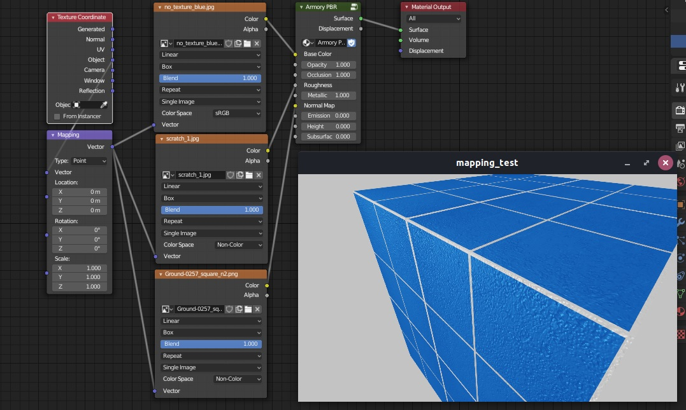

- Updates to wave material node

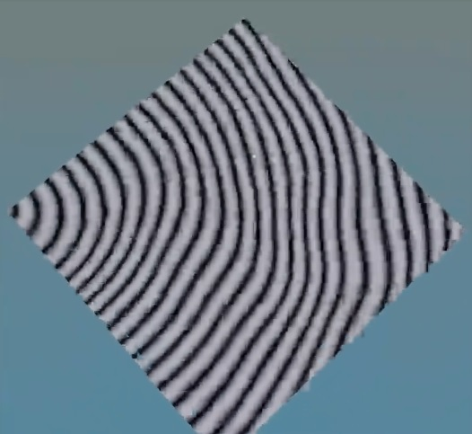

- Exposed canvas dimensions
- Fixes to exporter
- Fixes to translation nodes
- Fixes to noise in shaders
- More UV length flexibility
- Mouse delta reset
- Field of View uniform added
- Camera Up and Right uniforms added
- Exposed previous camera velocity (prevV)

[See Armory commits here](https://github.com/armory3d/armory)

[See Iron commits here](https://github.com/armory3d/iron)

Contributors: 
- Lubos, Simonrazer, Sanva, Sandy1000, N8n5h, QuantomCoderQC

---

## Notable changes in Armorpaint (v0.8 since March)

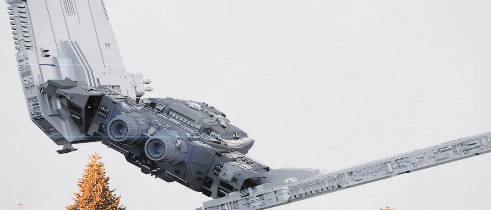
*A cool new Armorpaint front image*

- Emission flag for path tracer
- Improved obj export
- Saveable layer visibility
- Stencil rotation
- Pen pressure for brush angle
- Pen pressure sensitivity
- Angle dynamic brush
- Random brush node
- Improved layer export
- Improved node editor toggle
- Blended layered decal
- Mask to normal map
- Extended font atlas
- Improved 2D layer view
- Improved colorID sampling
- Improved layered blur
- Degrees for mapping node
- Mask to height
- Improved live brush cache
- Runtime language switch
- Begin localization
- Directional brush
- Improved cursor positioning
- Lazy mouse
- Brush stencil mask
- Brush stencil socket
- Draggable layer background
- Brush icon previews
- Brush preview
- Mobile steps
- Fixes for alpha channel export
- Signed macOS builds
- Vertex color bake

[See Armorpaint commits here](https://github.com/armory3d/armorpaint)

[See release notes here](https://armorpaint.org/notes.html)

---

## Community / Documentation Updates?

Did you read this months brand new Armory digest? Read it on the Armory forum!
Alternatively you can read them on Github 1 as they’re being compiled
Want help write or want to showcase something you’ve made? Feel absolutely free to contribute here
Not the best writer? Don’t worry, we’ll fix your text before published on the forum
Or better yet, discuss and make new threads about things you find interesting related to Armory!

- Nothing notable happened this month in the forum or discord

- The documentation was updated x times this month with contributions to:

---

## Featured Example

### **Physics pick**

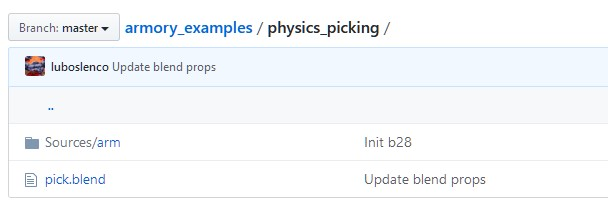

Have you ever wondered if you could somehow select an object by using the mouse? Then you should check out this months featured example:

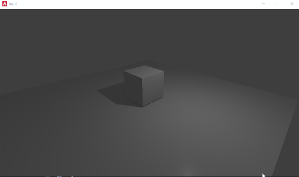

#### **How does it work?**

Briefly, it works by selecting the first physics entity that is encountered by a vector originating from the camera position in the direction of the mouse cursor (x/y screen coordinates):

```haxe
var rb = PhysicsWorld.active.pickClosest(x, y);
```

Once the user clicks with the mouse button (onMouseDown function attached to the kha.input.Mouse listener), it will check if our selected object has the name "Cube:

```haxe
if (rb != null && rb.object.name == 'Cube')
```

If that statement is true, then we want to lift up the object and afterwards synchronize the rigidbody transforms for the object:

```haxe
rb.object.transform.translate(0, 0, 1);
rb.syncTransform();
```

You can use the iron object class to translate the object as well:

```haxe
object.transform.translate(0,0,1);
```

As long as you synchronize the transforms regardless.

If you we look at the same example but with nodes, it looks like this:

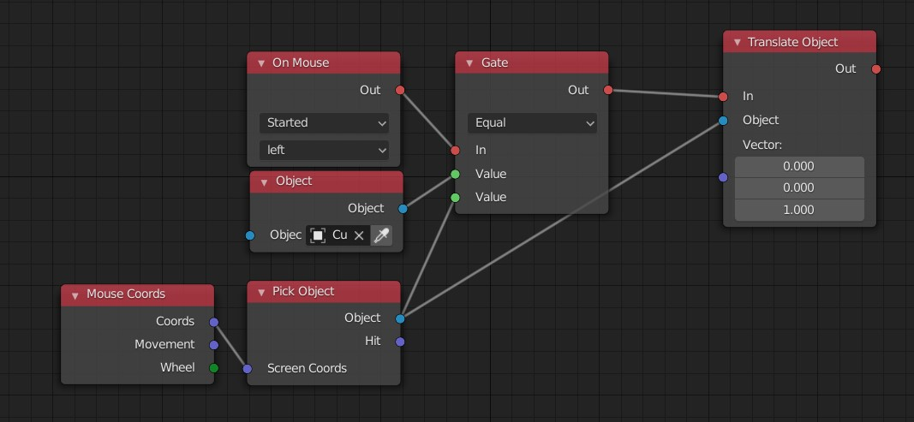

To briefly explain the above - Once we provide a mouse left click (**On Mouse node**), we want to start an evaluation of the object that our mouse is pointing to (**Gate**), at the same moment. This is provided the coordinates of the cursor at that point, and given to a **pick object node**. That node delivers the closest object from the camera in that given direction (vector from camera) that falls upon a rigid body object. That value (**Object**) is fed to our gate evaluation which we check corresponds with the object we want to check has been clicked (**Cube**). If the expression is true (**Equal**), we want to translate that same cube object by a vector.

Find the example here: https://github.com/armory3d/armory_examples/tree/master/physics_picking

---

## Featured tutorial

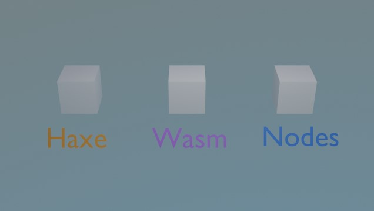

This months tutorial is written tutorial by BlackGoku36 that gets you started on traits - what they are, how to make and how to use them. The tutorial walks you through the process of making them in either using Logic Nodes, Haxe, WASM (Coding traits in the Rust language through WebAssembly) and finally how easy it is to setup UI (Canvas) traits.

View it here: https://blackgoku36.github.io/BG36-tutorials/docs-html/Armory/Basics/trait.html

*Got a tutorial you would like featured? - send me a pm*

---

## Showcase spotlights

**Smxham** showcased something really cool on Discord:


**GA Development** published Obstacle Roads! on Google Play for Android:

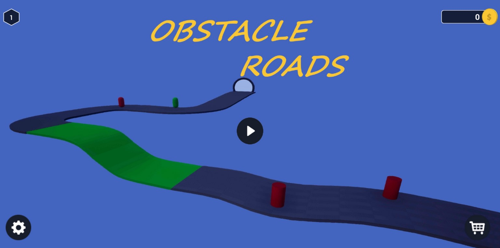

[Google Play link](https://play.google.com/store/apps/details?id=com.gadevelopment.obstacleroads)

*Got something that you'd like to showcase? - Showcase it on Discord or send me a pm*

---

## Monthly Digest article - Linked asset management in Blender and Armory3D

*This is a new section that isn't a tutorial as such, but more an article that can be about everything and nothing. This month is about linked assets.*

Linked assets is an often overseen feature of both Blender and Armory3D, that requires a fair bit of overview and organization to use efficiently, but it pays off once you learn it. If you have experience in Unity or Unreal, you'll know that a lot of assets are often assets inside assets that can be edited indepedently but updated seamlessly. This allows for a very versatile way of working with assets.

The usual way of importing assets from other .blend files is by using the **append function**, this can be fine if you've a single asset you want to import, as it will be imported as a local single-user object. The problem is that if you've a set of assets you want to have lots of - this can be walls for instance:

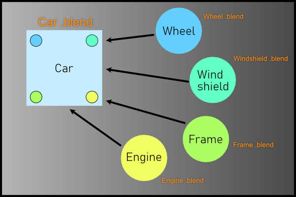

Say you want to change the wall model, perhaps add an extrusion or change the color? Now you'd have to through all of the assets individually and change this. That's one example where linked assets come to power. With linked asset you just have to change the original asset. Using the **Link Asset** function, you just select the object you want to link inside the linked .blend file.

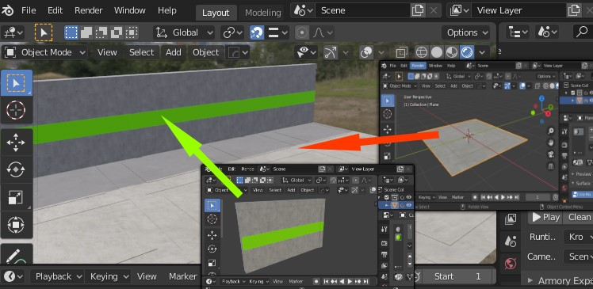

If you haven't worked with linked objects before, you'll notice that you won't be able to move the object you just linked - That is because the linked asset's object data such as position, rotation and scale is also linked. That is where proxies come into place. Armory has an integrated proxy function which will make a proxy from a linked object. Making a proxy reveals 6 options that you can toggle, which is the specific data you want your proxy to synchronize to during runtime:

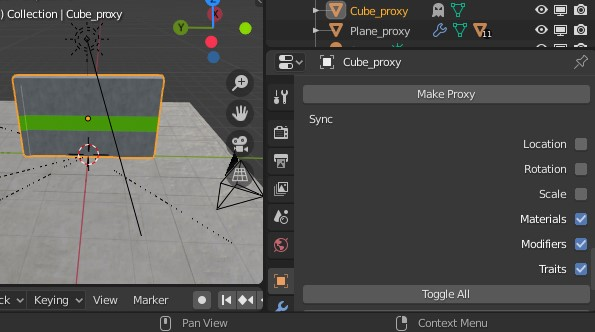

You can see if your object is a proxy by a little ghost icon outside the object in the outliner. Additionally you can see if an object is directly linked by the chain icon in front of the object name: 

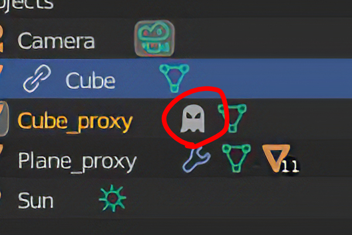

Various data in Blender can be linked, but Armory mainly supports object data proxies. In Blender and Armory, proxies excel at being used for repetitive elements, such as walls objects in this case, but it's worth knowing that you can also link materials, and as such create material libraries that can be changed centrally from a different .blend file:

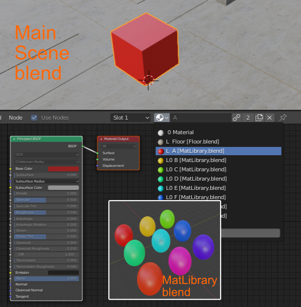

When it comes to repetitive elements, there's another Armory3D feature that can help in this case to increase performance - Instancing. It's possible to have lots of the same objects, linked from various blend files, and parented to work as instanced objects for a performance gain:

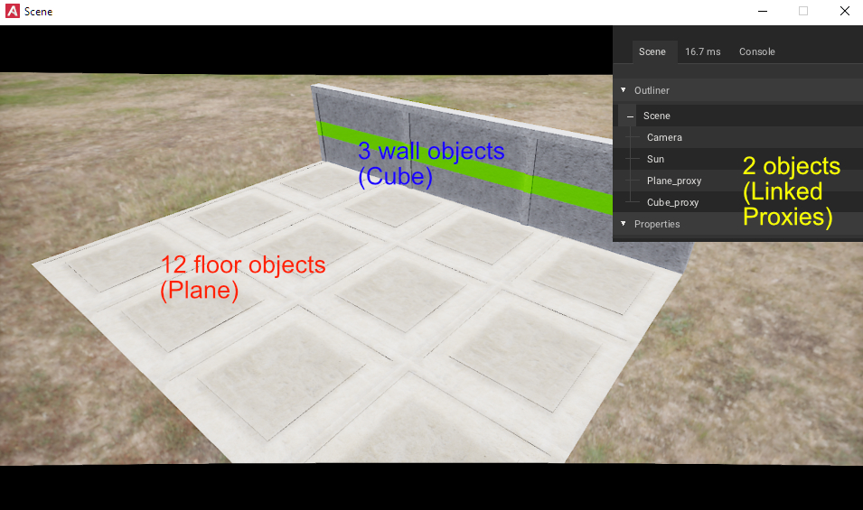

To sum up this brief article/section, linking objects and materials can very useful when working with projects in Armory, especially as the project becomes larger and project structure becomes hard with large blend files. Often, models aren't final versions either, and things are prone to change in game levels. 

Additionally, if you want to read more about linking objects, you can find more information in the Armory wiki:

[Multi-user and linking](https://github.com/armory3d/armory/wiki/multiuser)

[Instancing](https://github.com/armory3d/armory/wiki/instancing)

---

## Support Armory and the ecosystem

- Lubos @ Armory3D, Armorpaint, Iron - https://armory3d.org/fund.html
- Robert @ Kha, Kinc, Krom - https://www.patreon.com/RobDangerous

## Visit the Discord

- https://discord.gg/Vymh2r