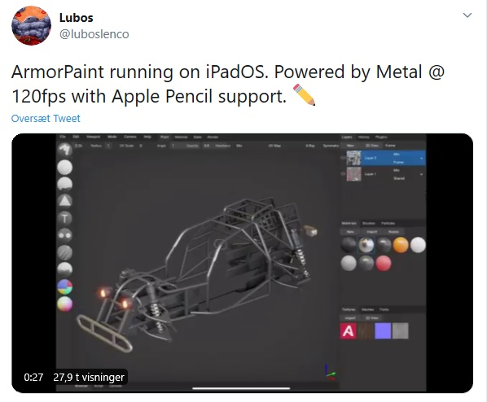
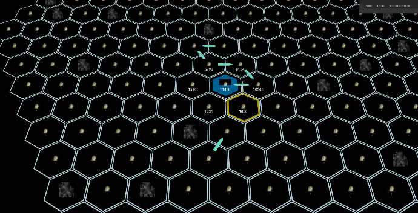
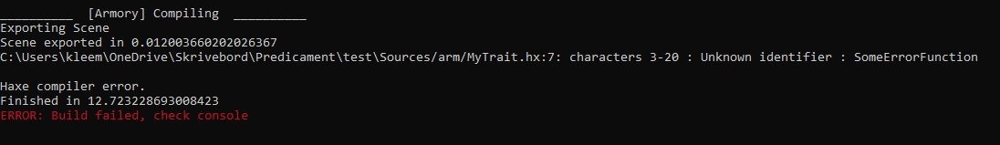
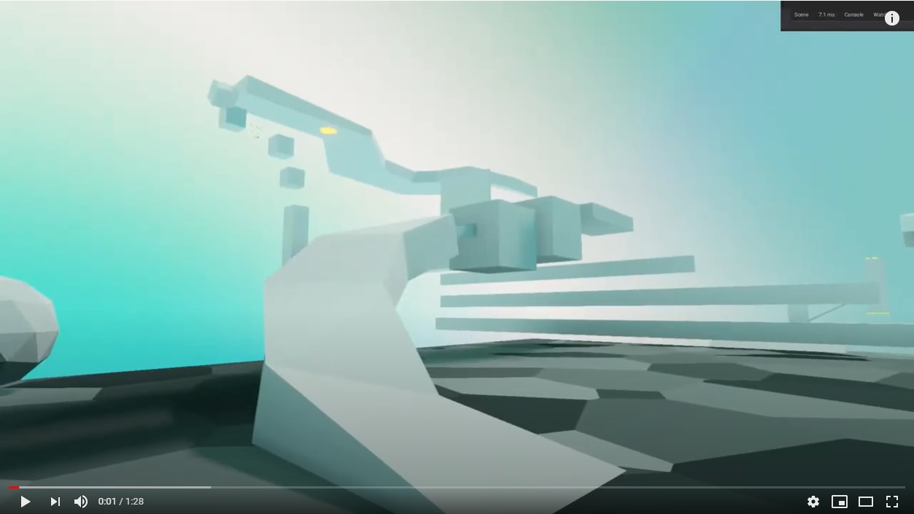
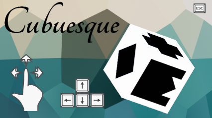

Armory Digest July 2020

This months issue of Armory Digest is a little later than usual due to holidays and being busy with work, but better late than never! Also, apologies if this months issue is a bit rushed.

## News

Lubos showcased Armorpaint running on iPadOS, running with 120fps being powered by Metal

Smxham won the first AGCG (Armory3D Community Gaming Competition) with the Hex-space inspired game for the Little Giant theme. He gratiously decided to pass on the rewards until next round, which means the next reward will be twice as big! It is to be concluded when the next round will be held, but presumably sometime around September/October?

## Notable changes in Armory (since June):

Quite a bit of fixes for Armory, including

Reworking of world/environment export with multiple scenes

Console coloring on some platforms

As well as:

- Updated shaders to receive shadow
- Implemented receive shadow settings for mobile with all light types
- Fixes for OnContactNode
- Fixes for probe writing on Windows
- Fixes for logging colors on Windows
- Fixes for SetSceneNode
- Updated renderpath skydome for Iron changes
- Implement irradiance for static backgrounds
- Renderpaths loads new world shaders
- Fixes for parameter naming
- Cleaned world shader generation
- Per world environment + LDR support
- Fixes for Hashlink (HL)
- Added silent parameter to CMFT
- Fix for physics raycast in HL
- CMFT use all available cpus
- Add haxe --times flag on verbose not debug_console
- Add missing import
- Add reroutes and frames to add node menu
- Fix ammo library loading
- Use regexp to validate haxe module name
- Filter haxe modules with invalid names
- Fix boolean node sockets
- Custom default values for custom sockets
- Colored terminal support on some platforms
- Custom socket type for node sockets
- Escape '"' in logic node strings
- Replace __js with syntax code
- Reflect operation for VectorMathNode
- Fix multi-usage of particle systems

And many more: https://github.com/armory3d/armory/commits/master

Contributors: Lubos, MoritzBrueckner, tong, Sanva

## Notable changes in Armorpaint (since 0.8 June):

- Tab align
- Font importing
- Sticky regions
- Add mask invert operator
- Draw scrollbar for combo
- Set envmap when reimporting HDR file
- Shader-based environment map prefiltering
- Improved paint vector handling
- Node data encoding fixes
- Baking fixes
- Add 128bit copy pipeline
- Improved theme options
- Add reimport operator to texture context menu
- Fix using multiple layer nodes per material
- More language options
- Removed CMFT dependency
- Localization fixes
- Add line draw
- Begin projection layer
- Use inflate / deflate via Krom
- Added live material preview
- Implement material node
- Aspect ratio for layer textures
- Handle BGRA layers
- List recent projects
- Enable shared sampler for Metal
- Rotated irradiance

And many more: https://github.com/armory3d/armorpaint/commits/master

## Showcase

Simonrazer made an Armory3D based entry to the Blender Gaming Competition (BGMC 32):

https://blenderartists.org/t/bgmc-32-our-project-in-armory/1238197/3?u=simonrazer

Simonrazer also made a first person platformer, showcased on Discord:

Mokauno made a game called Cubuesque

Try it out on Itch: https://mokauno.itch.io/cubuesque

## Featured tutorial

Basic portals by ArmoryBlender

Learn how to make portals with this Armory3D tutorial by moving the player location

https://www.youtube.com/watch?v=-6IUbl57AqI&t=144s

## Support Armory and the ecosystem

- Lubos @ Armory3D, Armorpaint, Iron - https://armory3d.org/fund.html
- Robert @ Kha, Kinc, Krom - https://www.patreon.com/RobDangerous   

## Visit the discord

- https://discord.gg/ccQyuHP