# Armory Digest May 2020

## Small community roundup

It's May, it's rainy (or sunny, or something in between). It's time staying inside an joining the first **ACGC!** (Armory Community Game Competition). Most likely, only a few enthutiastic souls will join, but it's enough - There's even a reward for the winner, see more below!

---

## News

### **Realtime path-tracing in Armorpaint**

Lubos implemented realtime path-tracing in Armorpaint. The technology is gradually maturing, and it's impressive how responsive it is even when you don't have the newest range of graphics card. Seemingly still only Nvidia/RTX so far, but it's very promising not only for Armorpaint but also for Armory3D.

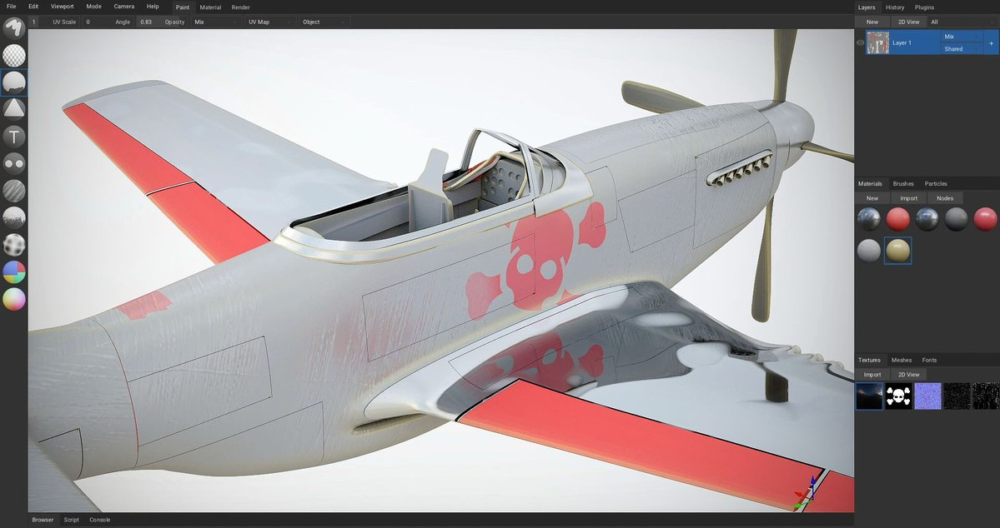

### **Minecraft and Unigine Export for Armorpaint**

Support for Minecraft and Unigine material export was added to Armorpaint. Apart from these Armory already supports Unity, Unreal and XPlane.

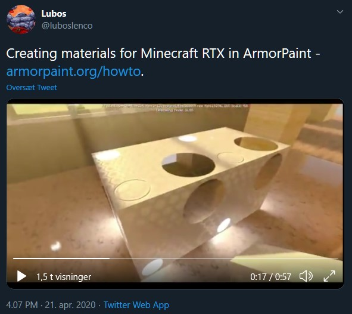

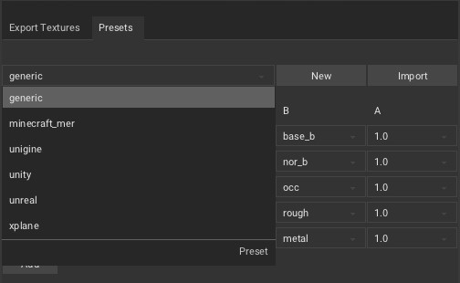

### **Live Brush Preview for Armorpaint**

Preview your brushes in realtime to get quick impression of how it. It's fast, responsive and great workflow improvement!

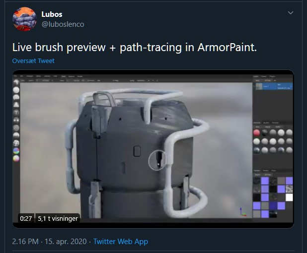

### **Internationalization added for Armorpaint**

While this commit was added last month by Calinou, Armorpaint have gotten more languages since, including French and Chinese.

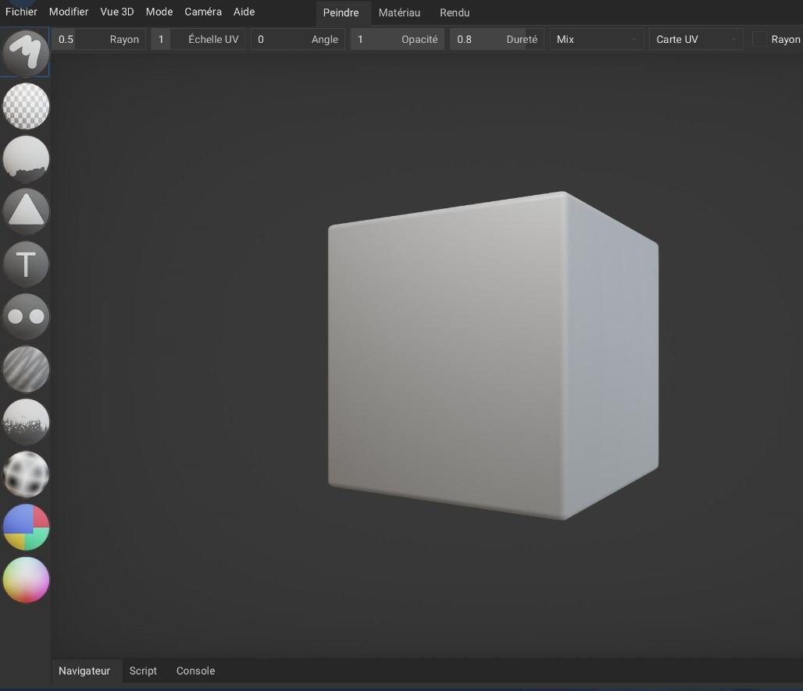

### **Blender Live-link for Armorpaint**

PiloeGAO have made a live-link addon for Armorpaint and Blender. For Live-links to other applications, there's support for Unreal Engine, Unity and Maya

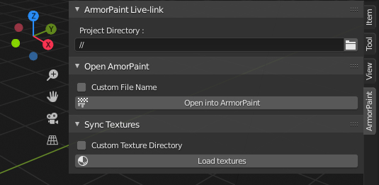

### **Sewing in Armorpaint**

Lubos showcased some nice directional brush painting. Really cool and useful feature!

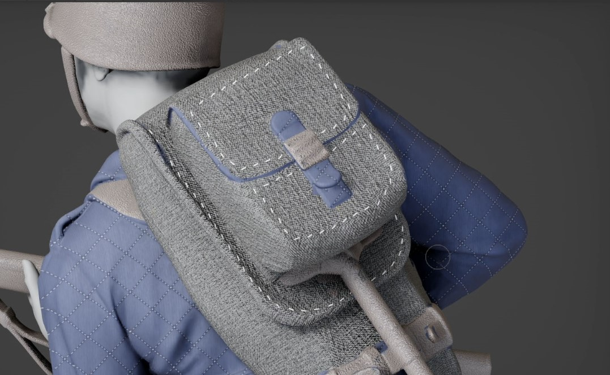

---

## Armory Community Game Competition #1

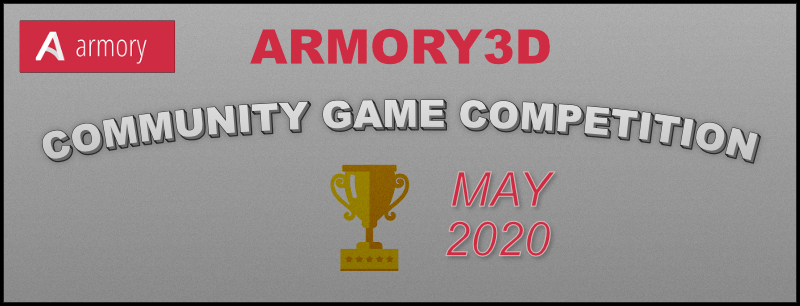

**Theme**: Little Giant

The theme is up to free interpretation, and it's up to you to decide how you understand these two words.

**Where to start?**
- No one expects a full-blown AAA game with lots of action - almost on the contrary. Tiny creative games are appreciated, as you can achieve really much with very little if you let your imagination unfold. If you need inspiration you should head over to Newgrounds, Kongregate, Miniclip or Itch and spend a few hours having fun and gathering inspiration.

- We recommend that you make a thread in this forums showcase section to describe your progress, and teach other users of your neat tips and tricks

Start: **Now, 1st of May**

End: **31st of May, 12:00 CET**

**Competition Poll:**
- At the end of the competition, a public poll will be made available to the forum members, where they will decide the winner. Mind you that each voting user will be checked, so it won't work by signing up a lot of recent users with no or just one posts. A list of voting criteria suggestions will be posted by the next Armory Digest edition.

**Reward:**
- Competitions are fun, but they're a little more fun if there's something to compete about. That's why I've thrown a little price with tiered 4 possible rewards, and you can choose 2!

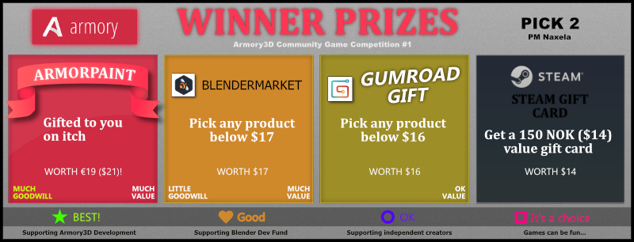

- **Armorpaint** will be gifted to you on Itch.io. Choosing this reward will provide additional goodwill with support for Lubos and the development of Armory3D and Armorpaint!
- **Blendermarket** - Select any product on the Blendermarket up to the value of $17. This will also indirectly support the Blender dev fund.
- **Gumroad** - Select any product on Gumroad up to the value of $16. Especially great if supporting independent creators of Blender addons!
- **Steam Gift Card** - A steam gift card of up to 150 NOK will be gifted to you. 

Naxela will contact the winner of the competition.

**Importance of the competition**

The primary focus of the competition is to have fun and be creative! 

---

## **Notable changes in Armory/Armory2D/Iron/ZUI**

This months Armory SDK is out, get it on itch: https://armory.itch.io/armory3d

- New "Has contact Array" node (*)

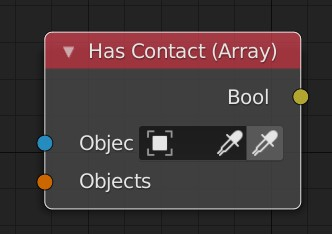

- New "Set Checkbox" node (*)

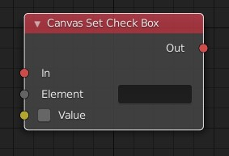

- New "On Canvas Element" node (*)

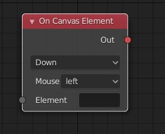

- Synchronized proxy trait (*)

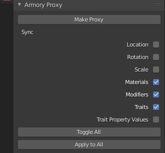

- "Set UI Scale" method for CanvasScript
- Value node stored as shader constant
- Shader constant method for global constants
- WalkNavigation script now sets flying speed with mouse wheel
- "On Canvas Element" node takes anchoring into account
- Index option for ArrayLoopNode
- Return value from CanvasGetCheckBox and CanvasGetSlider
- Trait UI reorder
- General exporter refactor and improvement
- Refactored ArrayAddNode and combined with ArrayAddUnique
- Refactored mesh, bone, skin, light export
- Refactor mapping node
- General code improvement and type annotation, PEP8
- Fix for value node with material parameters
- Fix for "Set Rotation" node
- Fix for colorramp node
- Fix for "Canvas Set Visible" 
- Fix for scene traits
- Fix for vector node
- Fix for LOD deletion
- Fix for logic call group
- Fix for camera
- Fix for debug console
- Fix for asset export
- Fix for Rigid Body issue on C-target

Contributors:
- Lubos, MoritzBrueckner, Sandy, QuantumCoderC, Sanva, RLP9GHR60I

[See Armory commits here](https://github.com/armory3d/armory)

[See Iron commits here](https://github.com/armory3d/iron)

---

## **Notable changes in Armorpaint (v0.8 since April)**

- Arguments class
- Font slots
- Custom brush node plugin example
- Custom brush nodes
- Improved cursor scaling
- 2D view pan shortcut
- Added baking workspace
- Added renderer option to preferences (Forward)
- Added tiled option to 2D view
- Update nodes on texture delete
- Improved brush parsing
- Import brush from texture
- Environment map visibility for path tracer
- Help button added
- Viewport color to theme
- Theme tab added to preferences
- Added shared cube mesh
- FBX bug fixes
- Split material preview compilation
- Fix for folder icon scale
- Added Unigine preset
- Live brush for path tracer
- Bake materials to textures
- Added fabric ball mesh
- Added brush import to menu
- Added material workspace
- Fix for radiance import
- Shader Ball mesh
- Label updates
- Custom default meshes
- Added Minecraft mer preset

[See Armorpaint commits here](https://github.com/armory3d/armorpaint)

[See release notes here](https://armorpaint.org/notes.html)

---

## **Showcase**

9987 showcased a game on Discord that he made for a game jam about making terribly bad games - He did alright:

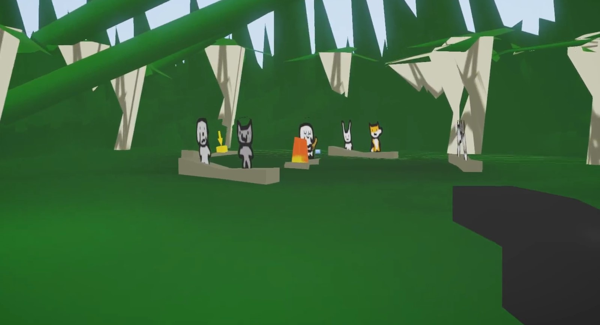

Due to the lack of showcased projects, I'll shamelessly mention my own little project, the Airport Lounge.

---

## **Featured Example**

*This months example in focus*

https://github.com/armory3d/armory_examples/tree/master/material_movie

Video texture is an example that shows you how to setup video textures inside Armory3D for the HTML5 platform. The way it works is by converting the provided video with the FFMPEG. It requires the FFMPEG binary path to be provided in the preferences. FFMPEG can be downloaded from here: https://www.ffmpeg.org/download.html

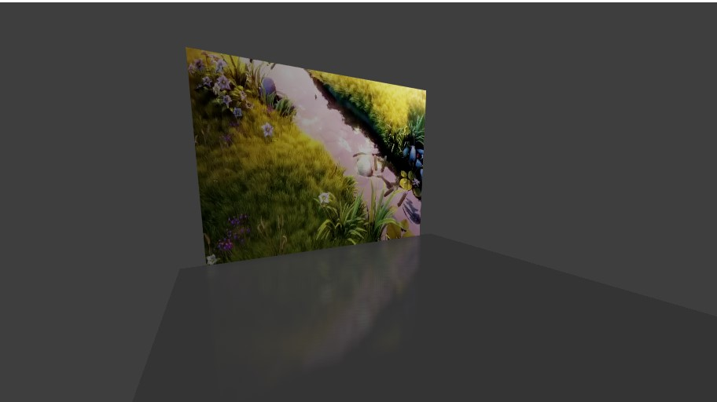

---

## **Featured tutorial**

- Attach Weapon to Character by Armory Blender (https://www.youtube.com/watch?v=WlVQHxOpbE0&t=350s)

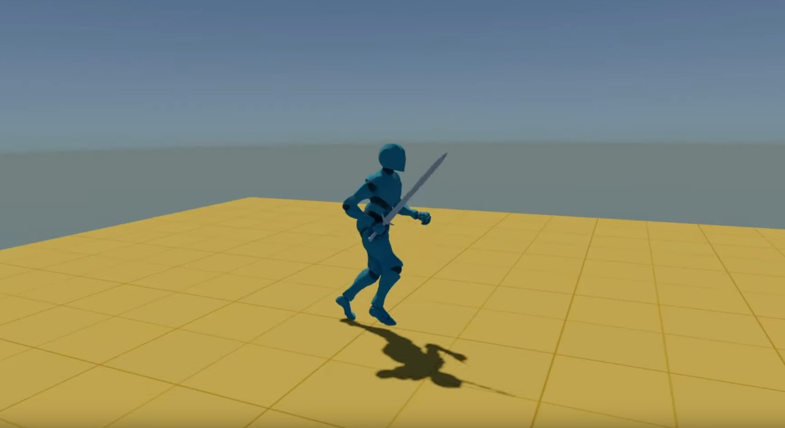

---

## Support Armory and the ecosystem

- Lubos @ Armory3D, Armorpaint, Iron - https://armory3d.org/fund.html
- Robert @ Kha, Kinc, Krom - https://www.patreon.com/RobDangerous

## Visit the Discord

- https://discord.gg/Vymh2r