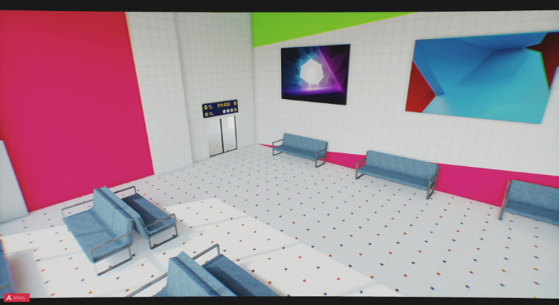
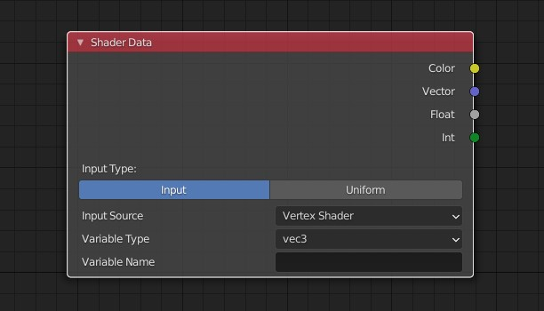
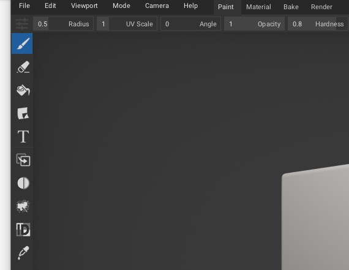

# Armory Digest September 2020

September is here, and the Armory digest is back. It's been a little while since last Digest issue, due to 
both holidays, workload and perhaps a tiny bit of lazyness.

# News:

## Changes to the Digest format

I've decided to change the format for the Digest to be a quarterly newsletter instead of a monthly one. In that way, there's more time to focus on tutorials and articles rather than just a brief overview with some half-written rushed articles. This also leaves me more time when I'm busy with work.

## Progress, progress, progress!

On the outside, it might not seem like there's been a lot of ground-breaking new stuff for Armory in the last year or so, but Lubos have been hard at work porting the back-end stuff of Armory (Iron) from Haxe/Kha to C (Kromx, now Armorcore). After all, you only rarely need to interact directly with the low-level structures of the engine. So, in the end it'll be both faster (and better allow multi-threading and the advantage of G5), and still allow for high-level traits Haxe, as WebAssembly will be leveraged. So in other words, you will be able to use C or Haxe to write your traits.

Read more: https://github.com/armory3d/armory/issues/1545

In the meantime, there's still been an influx of new features. MoritzBrueckner have been one of the more active contributors lately, adding a lot of fixes and additions to the Armory3D project, including a new shader data node, which is described under the **What's new in Armory** section.

Additionally, the september release of Armory has landed https://github.com/armory3d/armory/releases/tag/20.09 - Get in on itch: https://armory.itch.io/armory3d

## Lightmapping in Armory3D

It's finally landed, lightmapping have been underway for about a year and a half, since I made the first commit, and the first integrated lightmapping solution have been added. Located under the Armory3D baking panel, the Armory3D lightmapping is a specialized version of The Lightmapper.

# Notable changes in Armory3D (Since August):

- Added lightmapping

- Added Shader Uniform support
- Addes ShaderData node

- Improved quaternion and angle handling in logic nodes
- Exposed depth targets through uniforms
- Exposed render targets through uniforms
- Khafile rename for better readability
- Fix for android target options
- Included rotation for Apply Force and Apply impulse nodes
- sampler2D access to ShaderData node
- Fixes for wrong rsplit usage on file extensions
- Fix for missing View3D menu
- Add CopyTraitsFromActive operator
- Cleaned up property traits
- Fix for updated trait groups
- Fix for proxies with synchronized collections
- Copy Armory rigid body settings on Copy from Active
- Fix for bullet compoundshape related to CollisionObjectActivationState
- Fixes for logic node icons
- Remove and cleanup of operators from search menu

And many more: https://github.com/armory3d/armory/commits/master

**This months contributors:** Lubos, MoritzBrueckner, Naxela, QuantumCoderQC, Sanva, knowledgenude, niacdoial

# Notable changes in Armorpaint (since August):

- New icons added

- Save window rectangle on Darwin/OSX
- Improved node preview
- Special orbit behaviour from top view
- Fix for material id discard
- Fix for face fill using colorid
- Fix for wireframe rebuild
- Temporarily disabled live material on Vulkan
- Save window rectangle on Linux
- Handle font assets in project format
- Improved font handling
- Opacity socket used for fill layers
- Overlay blend fixes
- Fix for brush unlock
- Make 3D cursor work in Vulkan
- Updated VKRT instructions
- Bgra swap for Vulkan
- Fix for Vulkan
- Fix for object selection in render mode
- Updated japanese locale
- Update decal preview on new project
- Use correct copy pipeline for D3D12
- Wrap envmap in pathtraced mode
- Fix for raytrace path compilation
- Updated cursor sets
- Armorcore submodules added
- Fix for color comparison
- Fix for array types
- Updated VR Interface
- Added forward VR path
- Handle vulkan shader extension
- Begin vulkan raytracing shaders
- Included spirv shaders for vulkan raytracing

## Featured tutorial

## Support Armory and the ecosystem

- Lubos @ Armory3D, Armorpaint, Iron - https://armory3d.org/fund.html

- Robert @ Kha, Kinc, Krom - https://www.patreon.com/RobDangerous   

## Visit the discord

- https://discord.gg/ccQyuHP
